# Sanifere App Structure & Feature Analysis

This document provides a graphical and textual representation of the Sanifere application based on the analysis of 32 screenshots. It is intended to help AI and developers understand the existing system for extraction and inspiration.

## Mermaid Diagram: Application Architecture

```mermaid
graph TD
    Login["Login Screen<br/>(User/Password)"] --> Main["Main Menu<br/>(Navigation Toolbar)"]

    Main --> Ventes["Ventes (Sales)"]
    Ventes --> VDetail["Vente au DETAIL"]
    Ventes --> FDetail["Facturation au DETAIL"]
    Ventes --> FGros["Facturation en GROS"]
    Ventes --> FPro["FACTURE PROFORMA"]
    Ventes --> CashClose["FERMETURE DE LA CAISSE"]
    Ventes --> Vouchers["Règlements des BONS"]

    Main --> Achats["Achats (Purchases)"]
    Achats --> Recp["Réception/Achats"]
    Achats --> AutoCmd["Commande AUTOMATIQUE"]
    Achats --> ManCmd["Commande Manuelle"]
    Achats --> PaySupp["Règlements FOURNISSEURS"]

    Main --> Fichiers["Fichiers (Master Data)"]
    Fichiers --> ProdArt["Produits/Articles"]
    Fichiers --> Clients["Clients"]
    Fichiers --> ServCli["Services-CLIENTS"]
    Fichiers --> Fourn["Fournisseurs"]
    Fichiers --> FamProd["Familles-PRODUITS"]

    Main --> Edition["Edition (Reporting)"]
    Edition --> SitCli["Situation CLIENT"]
    Edition --> FollowSales["Suivi des VENTES<br/>(Day/Product/Invoices)"]
    Edition --> SitFourn["Situation FOURNISSEUR"]
    Edition --> FollowPurch["Suivi des ACHATS"]

    Main --> Gestion["Gestion (Management)"]
    Gestion --> CaisseConsult["Consultation CAISSE"]
    Gestion --> CaisseJournal["Journal CAISSE"]
    Gestion --> Dashboard["Tableau de bord<br/>(Profit Product/Day/Month)"]
    Gestion --> Stats["Statistiques"]
    Gestion --> Losses["SORTIE des PERTES"]

    Main --> Stock["Stock (Inventory)"]
    Stock --> StockCard["Fiche de stock produit"]
    Stock --> StockMvmt["Mouvements du Stock"]
    Stock --> StockListing["Listing du STOCK<br/>(Expired/Prices/Rupture)"]
    Stock --> Regularize["REGULARISATION du STOCK"]
    Stock --> Valuate["Valorisation du stock"]
    Stock --> Inventory["Inventaire du STOCK<br/>(Surface/Magasin)"]
    Stock --> StockReset["REMISE A ZERO stock"]

    Main --> Prog["Programme (Settings)"]
    Prog --> Prefs["Préférences"]
    Prog --> KeyProg["Programmation TOUCHE"]
    Prog --> Passwords["Mots de passe"]
```

## Module Deep Dive

### 1. Fichiers (Master Data)
This module handles all foundational entities.
- **Fiche Produit**: Rich data capturing Designation, Reference, Price (Purchase, Selling, Margin), Barcode, Unit, Brand, Category, Family, Expiry Date, and Stock Alert levels.
- **Fiche Client**: Code, Name, Department, Credit Limit, Address, Phone, Email.
- **Famille Produit**: Simple classification for reports and stock grouping.

### 2. Ventes & Achats (Transactions)
Standard ERP flows for wholesale and retail.
- **Invoicing UI**: High-density grid for line items (Designation, Code, Stock, Price, Qty, Disc%, Total). Highly keyboard-driven (F-keys shortcuts).
- **Proforma**: Quote generation before final sale.
- **Purchasing**: Intelligent order suggestions (Commande Automatique) based on stock levels and supplier relationships.

### 3. Inventory Control
The most comprehensive module.
- **Dual Stock Locations**: Distinguishes between "Surface" (Sales floor) and "Magasin" (Warehouse).
- **Stock Movement Tracking**: Auditable logs of every product entry/exit.
- **Inventory Reconciliation**: Dedicated manual entry screens for regularizing physical vs. system counts.

### 4. Financial & Management Support
- **Cash Register (Caisse)**: Detailed daily journals and consultations.
- **Profitability Analysis**: Dashboard focusing on profit margins at high granularity (per product).
- **Loss Tracking**: Explicit tracking of spoilage or losses (Sortie des Pertes).

## Visual Design Overview
- **Color Palette**: Dominated by high-contrast Green/Teal headers, Yellow/Beal-yellow backgrounds, and Blue/Green input fields.
- **Layout**: Classic desktop Windows-style MDI (Multiple Document Interface) feel, maximize data density.
- **Navigation**: Top-level horizontal menu with deep vertical drop-downs.
- **Interaction**: Heavy reliance on function keys (F1-F12) for speed and accessibility.
